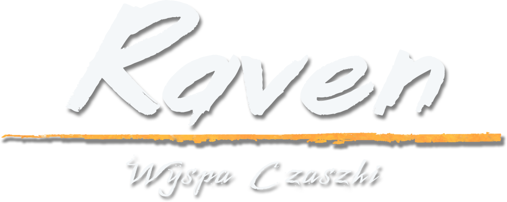
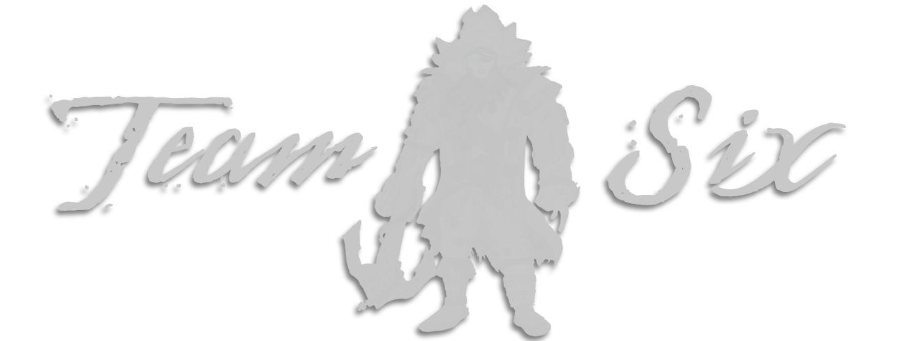
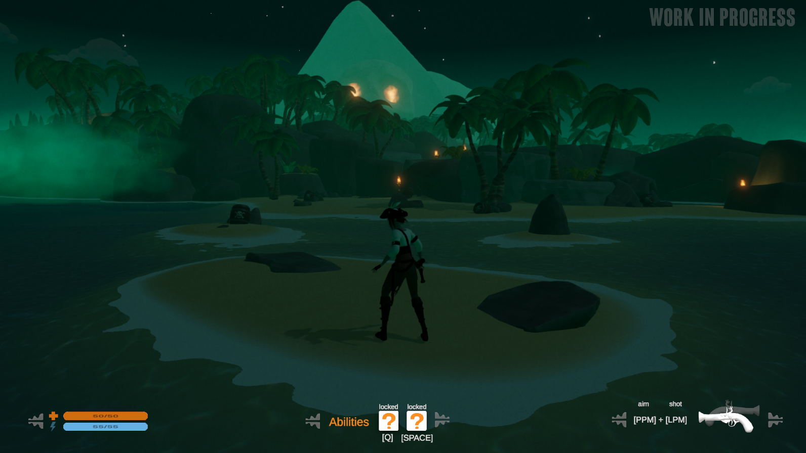
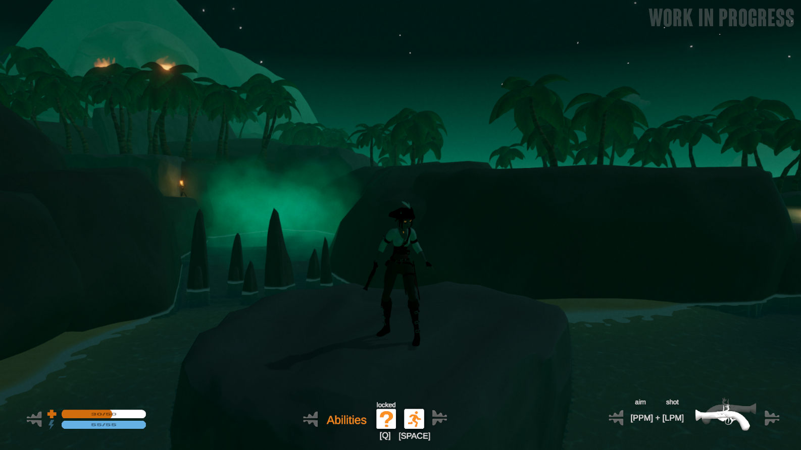
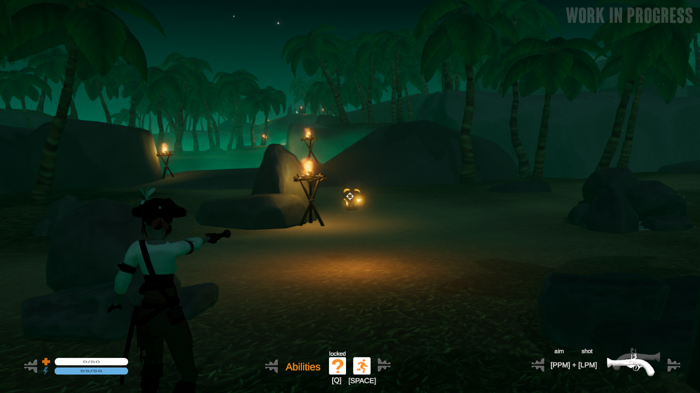
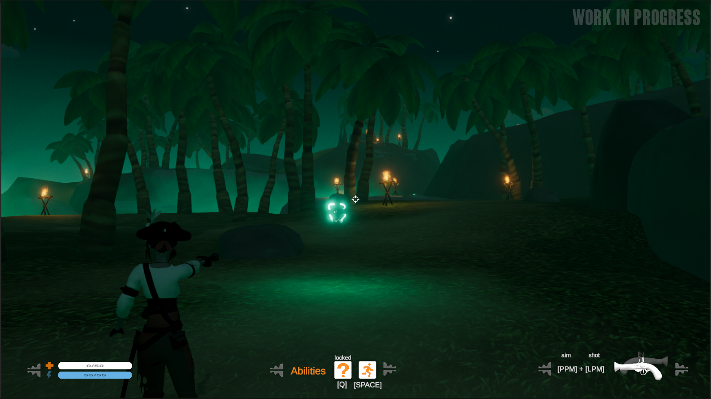

<h1>Raven: Skull Island</h1>

**Raven: Skull Island** is a third-person action-adventure game with puzzle-solving elements, set on a mysterious and cursed island.

You play as Raven, a young pirate who miraculously survives a shipwreck caused by a violent storm. But something is wrong. She’s alive, yet not quite herself. A dark curse has bound her to the island, where the souls of long-dead pirates still linger in the form of haunted skulls.

Face the mystery, survive the curse, and fight to escape Skull Island before it consumes you completely.

## Project Origins

The game was originally developed by a 6-person team as part of a graduation project at Game Dev School:

* **Programming:** Patryk Niewiarowski
* **Lead Artist:** Daniel Pytel
* **Additional Art:** Marcin Świgut
* **Game Design:** Andrzej Kula, Wojciech Nikorowicz, Łukasz Lampka
* **Project Mentor:** Andrzej Zawadzki, former Lead Gameplay Designer at CD PROJEKT RED

The initial commit reflects the exact [state](https://www.youtube.com/watch?v=zeqDeDUHbcQ) of the project at the time it was submitted for evaluation at Game Dev School.

## Continuing Development

All subsequent updates, including bug fixes, graphical improvements, system upgrades, design changes, project restructuring, and restored or reworked features, are the result of solo development work by me, **Daniel Pytel**.

What began as an effort to preserve the original graduation project has gradually evolved into a much broader modernization and revival of the game.

The project is now being actively maintained and developed with the goal of bringing the original game forward to modern versions of Unity while addressing technical debt, unfinished systems, legacy solutions, and design limitations left from the original production.

Rather than rebuilding Raven: Skull Island from scratch, the current development focuses on carefully improving the existing game while preserving its original atmosphere, identity, environments, artwork, and core ideas.

## Modernization

A significant part of the current work is dedicated to modernizing the original project and its underlying technology.

Recent development has included a major engine upgrade and a comprehensive project-wide audit, followed by extensive cleanup, fixes, reorganization, and modernization of legacy systems.

The project now runs on **Unity 6**, with several major systems and packages brought up to date. This includes the migration of the camera system to **Cinemachine 3**, improvements to camera behavior and input handling, fixes to gameplay and UI systems, and extensive cleanup of outdated or unused project content.

The modernization process is not limited to keeping the project compatible with newer engine versions. It also provides an opportunity to revisit systems that were originally built under the time constraints of a graduation project and redesign them where necessary.

Current development areas include:

* Maintaining compatibility with current Unity versions
* Refactoring and modernizing legacy gameplay systems
* Improving project structure and removing obsolete content
* Fixing long-standing gameplay, UI, camera, and interaction issues
* Improving camera controls, framing, collision, and player tracking
* Updating rendering, materials, lighting, and visual presentation
* Improving performance and stability on modern hardware
* Restoring, redesigning, or completing unfinished gameplay features
* Expanding the original game where it makes sense without losing its identity

## Technology

The project currently uses a modernized Unity toolset built around:

* **Unity 6**
* **C#**
* **Universal Render Pipeline (URP)**
* **Unity Input System**
* **Cinemachine 3**
* **Animation Rigging**

The project continues to evolve alongside the engine, so individual package versions and implementation details may change as development progresses.

## Development Goals

The long-term goal is not simply to preserve the original version of Raven: Skull Island, but to gradually turn it into a more complete, polished, and technically robust realization of the original concept.

The main goals of the repository are:

* Preserve the atmosphere, visual identity, and core ideas of the original project
* Keep the game functional and maintainable on modern Unity versions
* Fix existing bugs and refine gameplay mechanics
* Replace outdated or fragile systems with cleaner modern implementations
* Improve visuals, lighting, presentation, and performance
* Rework or restore cut features such as melee combat and boss encounters
* Improve existing environments, interactions, puzzles, and gameplay flow
* Expand the game with new areas, puzzles, encounters, and narrative elements
* Revisit ideas that could not be fully realized during the original development
* Continue pushing the project beyond the limitations of its original graduation scope

## Development Status

Raven: Skull Island is currently an **active solo development project**.

The original graduation build remains an important reference point and part of the project's history, while the current version is undergoing continuous modernization, bug fixing, restructuring, and gameplay development.

Some systems, assets, and mechanics may therefore change significantly between revisions as older parts of the project are revisited and improved.

This repository also serves as a record of that process: from the original student production to an increasingly modernized and expanded version of the game.

## Current Direction

The recent development phase has focused heavily on the technical foundation of the project: upgrading the engine, auditing and reorganizing the project, resolving accumulated issues, and modernizing core systems such as the camera and input handling.

With that foundation being progressively improved, future development can increasingly shift toward gameplay, content, visual polish, restored mechanics, and further expansion of Skull Island.

The intention is to keep the spirit of the original project alive while exploring how far the game can be pushed beyond what was possible during its original development.
